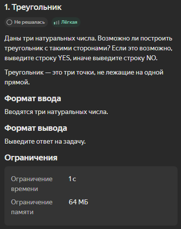
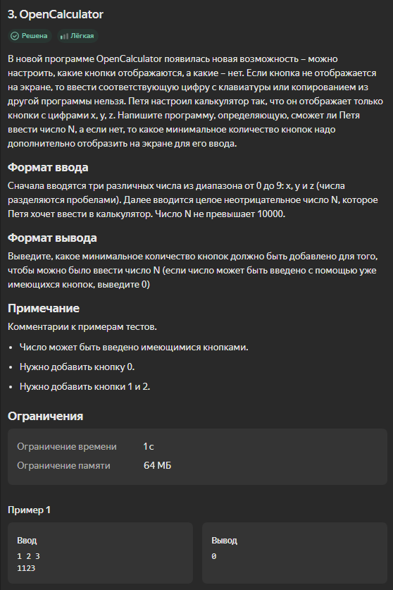
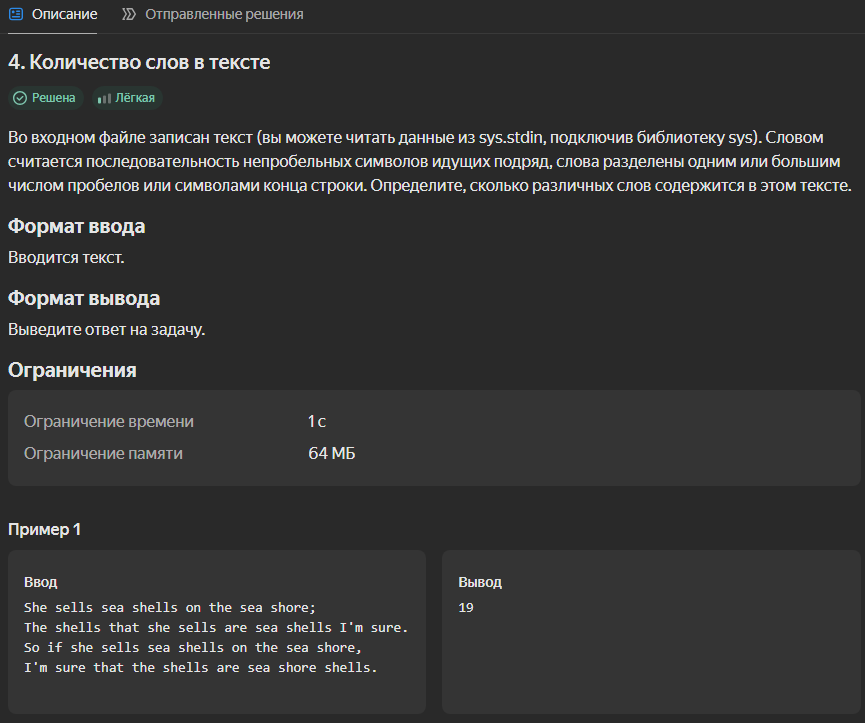
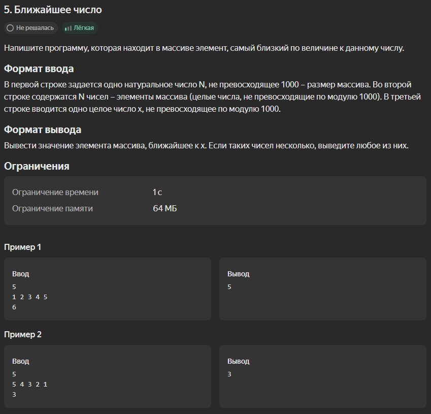
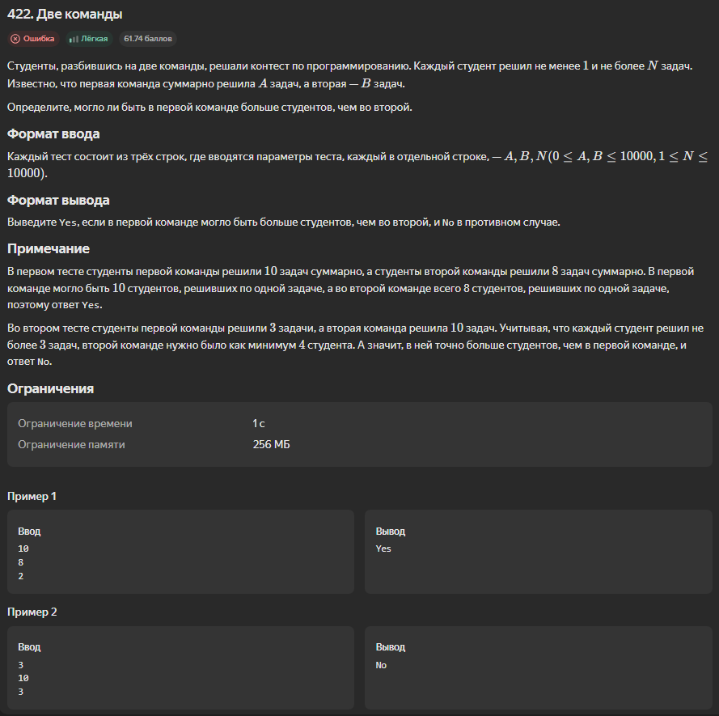
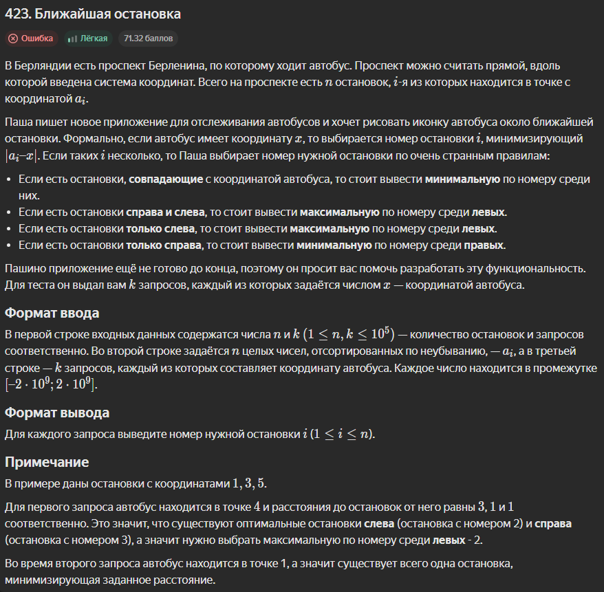
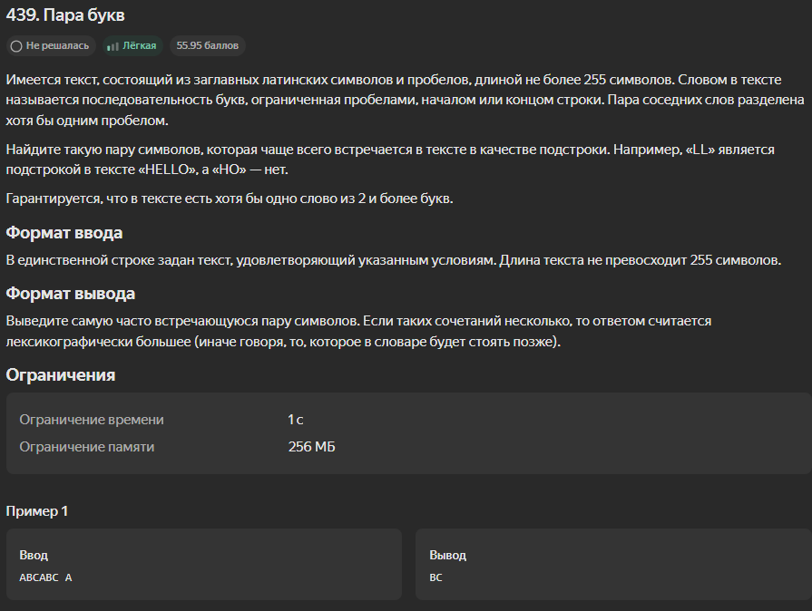
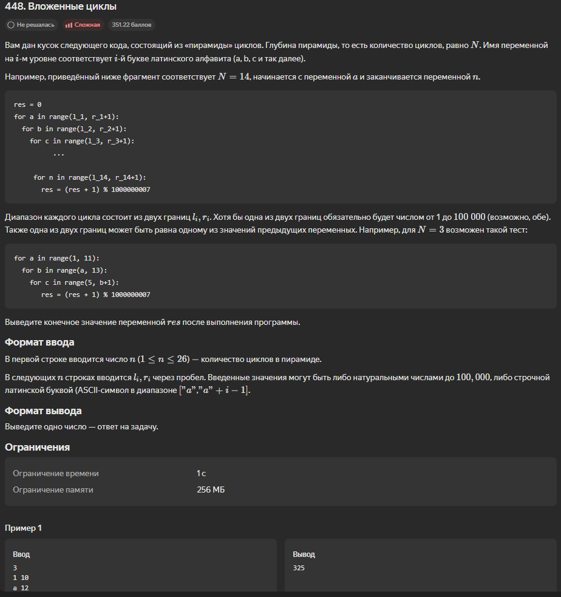

[Pull Request with simple tasks](https://github.com/ilya-noize/coderun-tasks/pull/1)

# Задачи из курса Java. Базовый Курс

[Ссылка на курс](https://stepik.org/course/187) 

[Project package](src/main/java/ru/yandex/coderun/solutions/stepik) 

# 1. Треугольник

# 2. Возрастает ли список?

# 3. OpenCalculator

# 4. Количество слов в тексте

# 5. Ближайшее число

# 422. Две команды

# 423. Ближайшая остановка

# 439. Пара букв

# 448. Вложенные циклы (hard)
